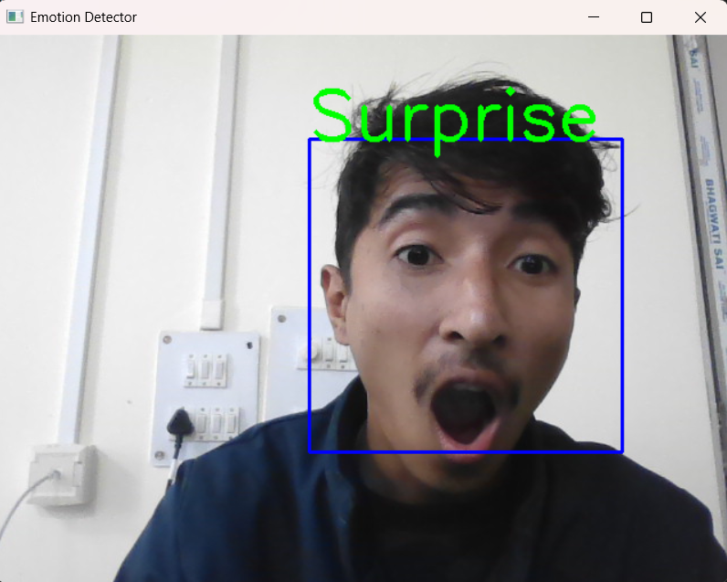
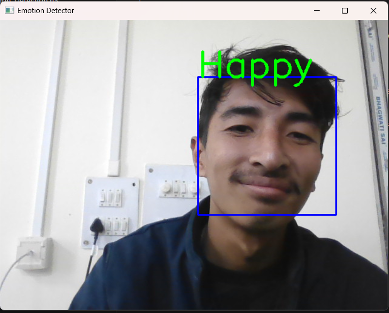
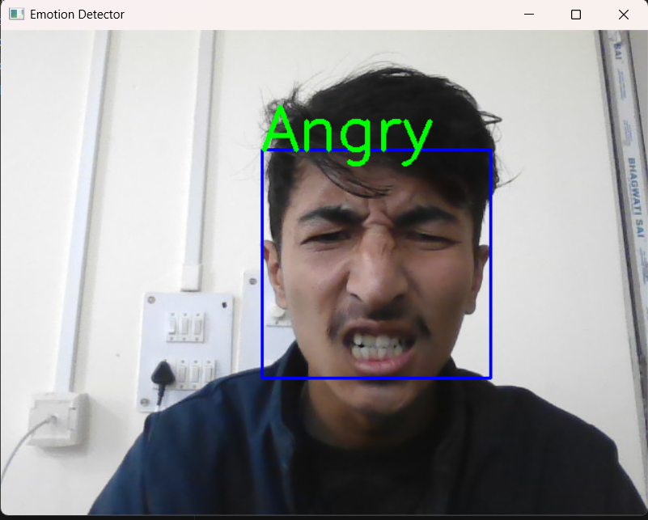
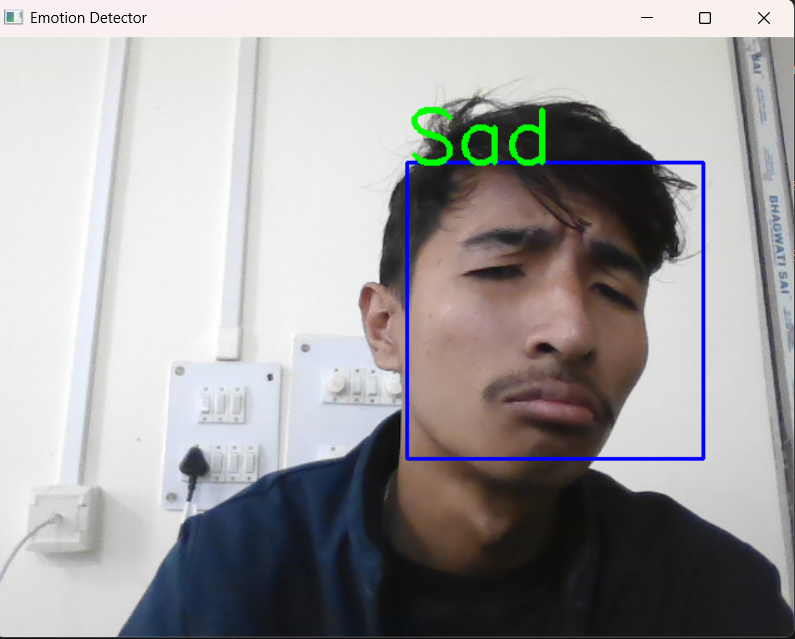
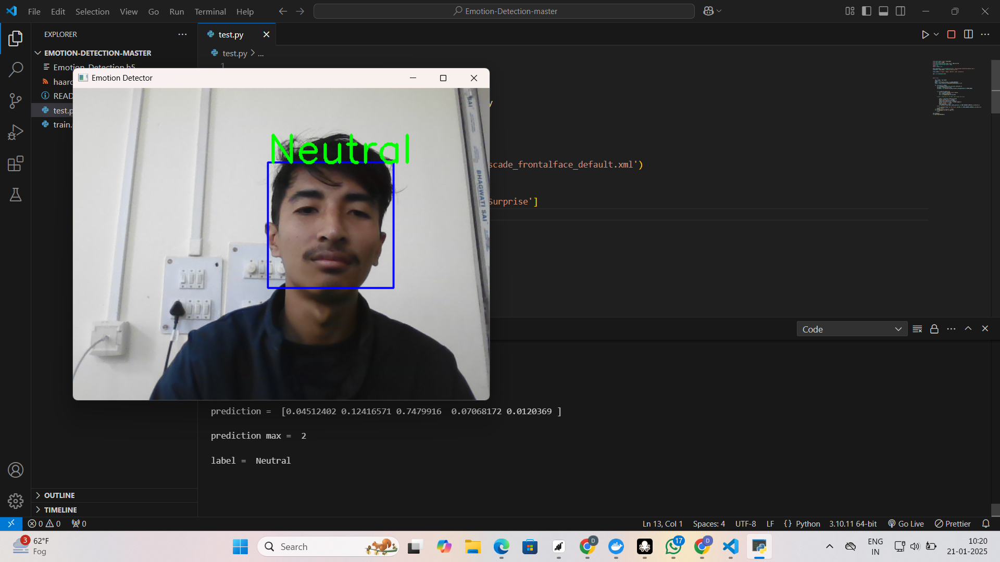

# 😄 Emotion Detection Using CNN 🤖

A real-time facial emotion detection system using Convolutional Neural Networks (CNNs) trained on the FER-2013 dataset. The model identifies human emotions from live webcam footage and categorizes them into one of five emotions: **Angry**, **Happy**, **Neutral**, **Sad**, and **Surprise**.

---

## 📸 Demo

> Real-time prediction using your webcam with Haar Cascade face detection and emotion classification overlay.







---

## 🧠 Model Architecture & Dataset

- **Model**: Convolutional Neural Network (CNN)
- **Dataset**: [FER-2013](https://www.kaggle.com/datasets/msambare/fer2013) (Facial Expression Recognition)
- **Accuracy**: Achieved a k-fold validation accuracy of **89.45%**
- **Frameworks**: TensorFlow / Keras

---

## 📂 Project Structure

```
📁 Emotion-Detection-CNN
│
├── haarcascade_frontalface_default.xml       # For face detection
├── Emotion_Detection.h5                      # Trained CNN model
├── test.py                       # Real-time detection script
├── README.md
```

---

## ⚙️ How It Works

1. **Face Detection**: Uses OpenCV’s Haar Cascade Classifier.
2. **Preprocessing**: Extracts the ROI, resizes it to 48x48, normalizes and reshapes it.
3. **Prediction**: The trained CNN predicts the emotion from the ROI.
4. **Display**: The predicted label is displayed on the video frame in real-time.

---


## 🔧 Requirements

- Python 3.6+
- TensorFlow / Keras
- OpenCV
- NumPy

Install dependencies using:

```bash
pip install tensorflow keras opencv-python numpy
```

---

## 🚀 Getting Started

```bash
git clone https://github.com/yourusername/emotion-detection-cnn.git
cd emotion-detection-cnn
python emotion_detector.py
```

> Press `Q` to quit the webcam window.

---

## 🌟 Features

- ✅ Real-time emotion detection
- ✅ Easy-to-use webcam interface
- ✅ Trained on diverse expressions from FER-2013
- ✅ Lightweight and fast

---

## 📌 Future Enhancements

- Add more emotion classes (like Fear, Disgust, etc.)
- Deploy as a web app or integrate with online platforms
- Optimize model for mobile applications

---

## 👨‍💻 Author

- 💡 **Daniel** – [GitHub](https://github.com/dani8946)

---


